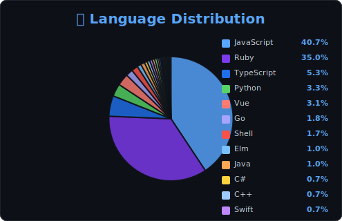
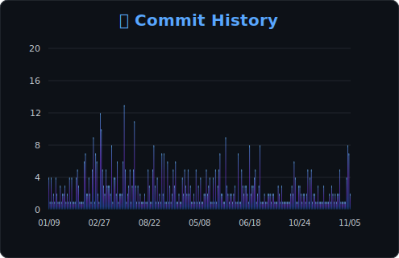
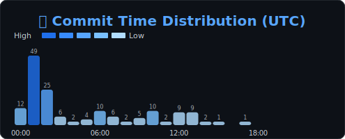
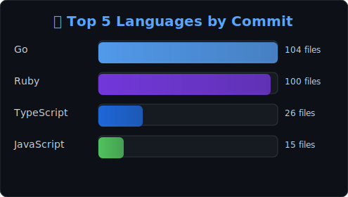
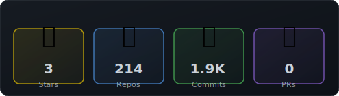

<!-- START_LANGUAGE_STATS -->

<!-- END_LANGUAGE_STATS -->

<!-- START_COMMIT_HISTORY -->

<!-- END_COMMIT_HISTORY -->

<!-- START_COMMIT_TIME -->

<!-- END_COMMIT_TIME -->

<!-- START_COMMIT_LANGUAGES -->

<!-- END_COMMIT_LANGUAGES -->

<!-- START_SUMMARY_STATS -->

<!-- END_SUMMARY_STATS -->

<!-- START_UPDATE_TIMESTAMP -->
*最終更新: 2025-11-03T02:34:36Z*
<!-- END_UPDATE_TIMESTAMP -->
